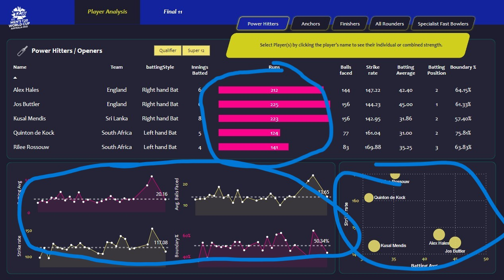
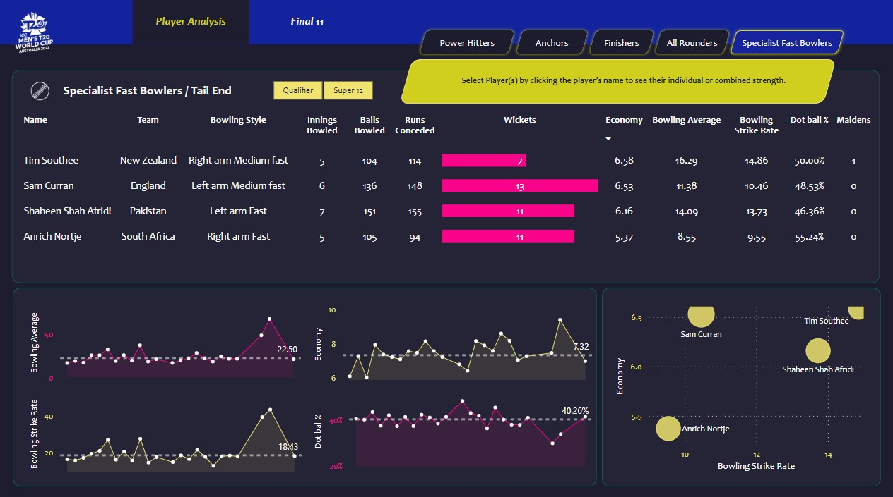
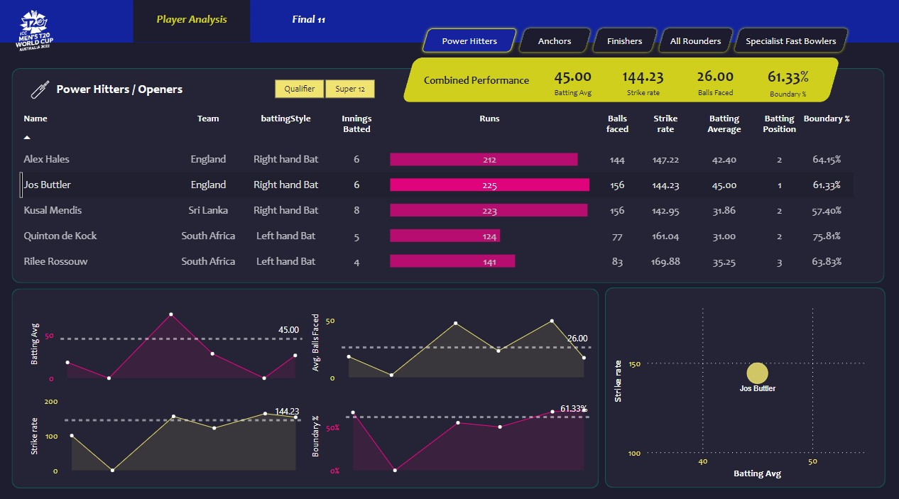

<div align="center">
  
  
  
  
  
  
  
  <br>

  <h2>🏏 T20 Cricket Analytics: ICC World Cup 2022 🏆</h2>
  <p>An interactive, data-driven Cricket Analytics application designed to help enthusiasts build their dream T20 squad using complex statistics, player roles, and visualization dashboards.</p>
</div>

---

## 🌟 Overview
**T20 Cricket Analytics** provides a comprehensive end-to-end data pipeline exploring the ICC Men's T20 World Cup 2022 dataset. From fetching and processing raw JSON match stats to building an interactive Streamlit web dashboard and comprehensive Power BI business intelligence reports, this project serves as the ultimate cricket team-building tool.

With role-specific categorization and performance metrics, you can dynamically evaluate players and assemble the perfect "Final 11".

---

## 🔥 Key Features

- ⚡ **Role-Based Player Analysis**: Quickly filter players by specialized roles: **Power Hitters, Anchors, Finishers, All-Rounders,** and **Fast Bowlers**.
- 🛠️ **Build Your Dream XI**: Dynamically select players and analyze combined statistics (total runs, strike rate, average, batting/bowling impact) to craft an invincible squad.
- 📊 **Interactive Visualizations**: Scatter plots and line graphs comparing Strike Rate vs. Batting Average, economy rates, and opponent-based performance over time.
- 📈 **Power BI Dashboard**: A rich `.pbix` dashboard designed to explore deeper insights and holistic tournament overviews.
- 🧹 **Robust Data Processing**: Clean and structure raw JSON feeds into digestible CSV formats utilizing Pandas inside a Jupyter Notebook environment.

---

## 📸 Sneak Peek

Here is a glimpse of the application interface highlighting the various analytics tools:

<table>
  <tr>
    <td align="center"><b>Power Hitters Stats</b><br></td>
    <td align="center"><b>Fast Bowlers Analysis</b><br></td>
  </tr>
  <tr>
    <td align="center"><b>Individual Player Stats</b><br></td>
    <td align="center"><b>Final 11 Selection Tool</b><br></td>
  </tr>
</table>

### Check out other features:
- ⚓ *[Anchors](Screenshots/anchors.jpg)* | 🎯 *[Finishers](Screenshots/finishers.jpg)* | 🔄 *[All Rounders](Screenshots/all_rounders.jpg)* | 🖱 *[Dynamic Hover Effects](Screenshots/hover_effect.jpg)* 

---

## 📂 Project Structure

```
📁 T20-Cricket-Analytics
│
├── 📁 t20-json-files/             # Raw ICC T20 JSON Dataset
├── 📁 t20-csv-files/              # Processed CSV Data files
├── 📓 t20-data-processing.ipynb   # Jupyter Notebook for data cleansing & transformation
│
├── 📁 web app/                    # Main Streamlit Application Source Code
│   ├── app.py                     # Entry point outlining tournament dashboard
│   ├── 📁 pages/
│   │   └── final_11.py            # Dedicated Dream Team builder Interface
│   ├── 📁 utils/
│   │   ├── data.py                # Data loading & aggregation scripts
│   │   └── visuals.py             # Plotly interactive charting utilities
│   └── requirements.txt           # Python package dependencies
│
├── 📁 Screenshots/                # App demonstration UI images
└── 📊 T20 Analytics Dashboard.pbix# Power BI File for deep analytics
```

---

## 🚀 Setup & Installation

To run this application locally, ensure you have Python installed.

**1. Clone the repository:**
```bash
git clone https://github.com/Heet369/cricket-data-analysis.git
cd cricket-data-analysis
```

**2. Create a virtual environment:**
```bash
python -m venv venv
# Windows
venv\Scripts\activate
# macOS/Linux
source venv/bin/activate
```

**3. Install dependencies:**
```bash
cd "web app"
pip install -r requirements.txt
```

**4. Launch the Streamlit App:**
```bash
streamlit run app.py
```

---

## 🛠️ Technology Stack
- **Data Collection & Processing:** Python, Pandas, BeautifulSoup / Requests (Jupyter)
- **Web Dashboard:** Streamlit
- **Visualizations:** Plotly Express / Graph Objects
- **Business Intelligence:** Microsoft Power BI

---

<div align="center">
  <b>Built with ❤️ by <a href="https://github.com/Heet369">Heet Mangroliya</a></b>
</div>
